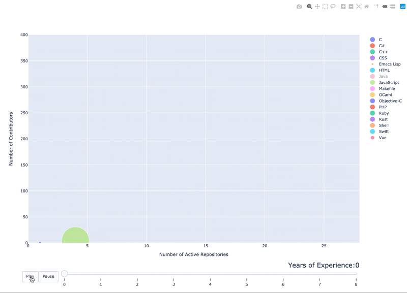

# swe-dev-task2
Jamison Engels - 17300599 
CS3012 - Software Engineering - Social Graph



## Project Description 

This social graph was created via the GitHub API through the python library pyGithub for CS3012.
My social graph pulled from a group of developers within an organization and looked to see how the
languages and repositories that each developer uses changes over time. To display this infomration, I used pyGithub to get gather all of the repository information of an organizations members. 

I believe that my social graph displays how developers tend to program in more languages in larger repositories with more developers over time. Looking at year 0, you can see how only a few languages are being used in small repositories with few collaborators. However after year 4, the team is using upwards of 10 languages within repositories with over 100 other collaborators. 

## Requirments
- [Python](https://www.python.org/downloads/)
- [Jupyter Notebook](https://jupyter.org/)
- [PyGithub](https://pygithub.readthedocs.io/en/latest/)
- [Plotly](https://plot.ly/)
- [Panda](https://pandas.pydata.org/)
- [NumPy](https://numpy.org/)
- [GitHub Access Token](https://help.github.com/en/github/authenticating-to-github/creating-a-personal-access-token-for-the-command-line)

## Usage
- Run jupyter notebook via CLI
```
jupyter notebook
```
- Navigate to project directory and run 


